# System architecture

## Processing flow

```mermaid
flowchart LR
    A[Import case<br/>application JSON + 1–6 artwork panels] --> B[FastAPI validation<br/>schema, media, hashes, panel order]
    B --> C[SQLite case store<br/>assign to uploader and queue]
    C --> D{Cached reader result?}

    D -->|Yes| H[Deterministic field matcher]
    D -->|No| E{Selected reader mode}

    E -->|LLM vision| F1[Gemini via OpenRouter]
    E -->|OCR| F2[Tesseract<br/>local preprocessing]

    F1 --> G[Literal transcript blocks<br/>evidence boxes and uncertainty]
    F2 --> G

    G --> I[Recognition cache]
    I --> H

    H --> J{Automated outcome}
    J -->|Pass| K[Available for inspection]
    J -->|Review| L[Reviewer workspace]
    J -->|Fail| L

    L --> M[Accept or reject<br/>the automated outcome]
    K --> N[CSV work-queue report]
    M --> N
```



## Application stack

- **React and TypeScript** provide the browser interface: work queue, file and catalog import, evidence viewer, review actions, settings, and CSV-report download.
- **FastAPI (Python)** provides the API, authentication, queue orchestration, file validation, reader adapters, caching, and deterministic comparison logic.
- **SQLite** stores users, sessions, preferences, queue state, review decisions, cached recognition results, and case metadata. Artwork is stored on the persistent application volume.
- **Tesseract OCR** provides the local/offline reader. It runs with local image preprocessing and does not require outbound network access.
- **Gemini vision via OpenRouter** provides the connected reader. It receives artwork only; expected application values are excluded from the extraction prompt.
- **The deterministic field matcher** applies configured checks to the reader’s literal transcript. The reader extracts text and evidence; it does not decide whether a value matches.
- **S3**, exposed through **CloudFront**, stores the public sample-case catalog used for evaluation and demos. The application imports from a fixed manifest, verifies its assets, and snapshots selected cases locally.
- **Docker Compose** packages the React build, FastAPI service, Tesseract runtime, and persistent data volume for repeatable local use.

## Deployment topology

The proof of concept runs as a single Dockerized application on an **AWS EC2 instance**. The container runs Uvicorn/FastAPI and serves the compiled React application from the same image.

**Caddy** sits in front of the application as the HTTPS reverse proxy. It terminates TLS for the public domain, forwards traffic to the application container, and enables secure HTTP-only session cookies in production.

```text
Browser
  → Caddy (TLS / reverse proxy)
  → Docker container on EC2
      → FastAPI / Uvicorn
      → compiled React UI
      → Tesseract
      → SQLite + artwork persistent volume
      → OpenRouter / Gemini, only in connected-reader mode

Public sample catalog
  → CloudFront
  → private S3 catalog objects
```

SQLite and in-process background processing are appropriate for this proof of concept: they keep local setup and deployment simple while supporting a small number of concurrent reviewers. A larger production deployment would move queue coordination, persistent data, and artwork storage to shared services—for example PostgreSQL, object storage, and dedicated background workers—before adding multiple application replicas.
